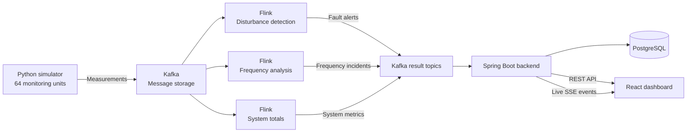
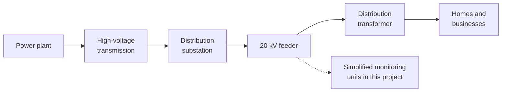
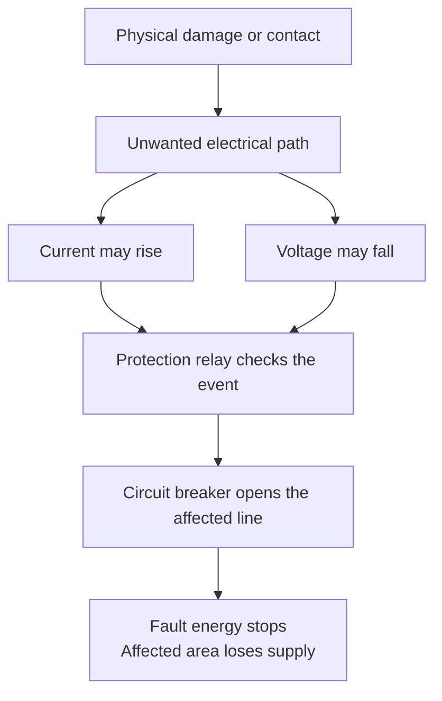
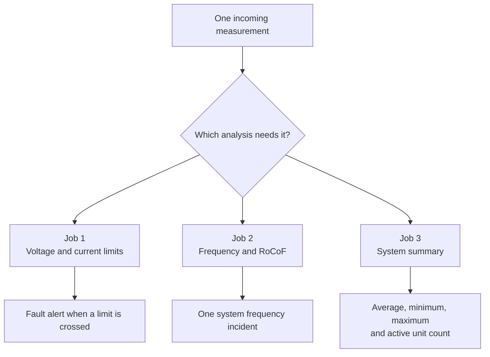
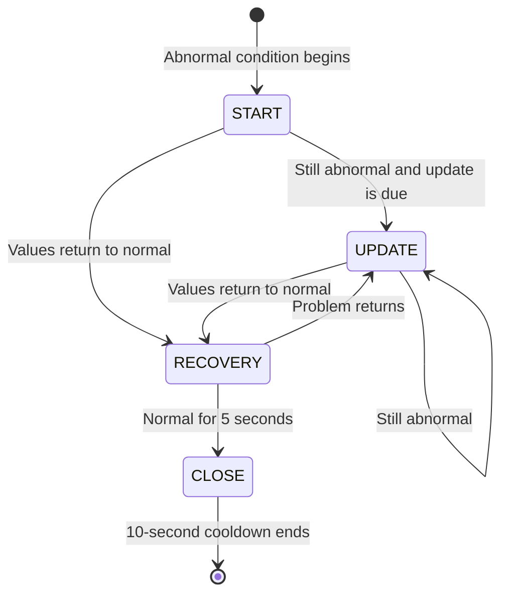
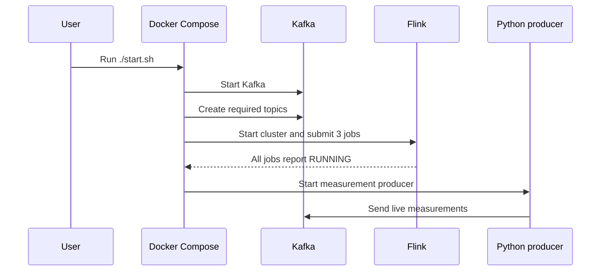

# Real-Time Monitoring of a Simulated 20 kV Distribution Network

*A beginner-friendly domain and implementation guide*

## Abstract

This document explains the electrical ideas and software design behind the network-monitoring project. It is written for readers who have no previous electrical or software background. The goal is to explain what the system observes, why network problems happen, what their effects can be, how the application processes data, and where its current limits are.

The project is a complete educational pipeline, but it is not a real protection system. Its best use is to demonstrate how simulated measurements can move through a live data platform and become dashboard alerts.

## 1. Introduction

This project is a small, complete example of a live electricity network monitoring system.

It creates fake measurements for a simulated **20 kV distribution network**, sends them through a data pipeline, finds unusual values, saves alerts, and shows everything on a web dashboard.

The simplest honest description is:

> Real-time monitoring and threshold-based disturbance alerting for a simulated 20 kV distribution network.

The system is useful for learning and demonstrations. It is **not** a protection relay and must not control real electrical equipment.

## 2. System overview

Think of the system like a school with many classrooms. Each monitoring unit is a student who reports what is happening in one room. Kafka is the school mailbox where all reports are placed, and Flink is the teacher who reads them and looks for problems. PostgreSQL is the school record book. Spring Boot acts like the office worker who finds records when someone asks for them, while React is the notice board where people see the latest information.

The real data flow looks like this:



*Figure 1. Complete application data flow from simulation to dashboard.*

### Why these tools were chosen

Each tool has one clear job:

| Tool | Why it fits this project |
|---|---|
| Python | Makes it quick to create changing demo measurements |
| Kafka | Keeps producers and consumers separate, so they do not all need to run at the same speed |
| Flink | Is made for calculations over live data and short time windows |
| Spring Boot | Connects Kafka, the database, and the web API in one backend |
| PostgreSQL | Stores structured records that can be filtered by time, type, and location |
| React | Updates dashboard parts without reloading the whole page |
| Docker Compose | Starts the local services in a repeatable way |

This separation also makes the system easier to understand. For example, changing a chart should not require changing the measurement simulator.

## 3. Electrical domain background

You do not need electrical engineering knowledge to understand the project. These are the main ideas.

### 3.1 Distribution network

Electricity travels through several network levels. Power plants first generate it. High-voltage transmission lines then move it across long distances. Distribution networks bring it closer to towns, businesses, and homes, and transformers reduce the voltage before it reaches customers.

This project uses **20 kV**, or 20,000 volts. That is a medium-voltage distribution level. It is suitable for feeders and substations, not for a sensor inside a house. A distribution substation receives electricity, changes or controls its voltage, and sends it through outgoing lines called **feeders**. A feeder is like a main road that branches into smaller roads as it supplies different areas.

The value 20 kV is a **nominal voltage**, which means it is the name and reference value for that network level. The real measured value moves a little as customers connect and disconnect, power flows change, and control equipment adjusts the network. A transformer near the customer later reduces this medium voltage to a much lower level that homes and small businesses can use.

The organization operating this part of the network is normally called a distribution system operator, or DSO. Its staff need to know whether feeders are healthy, whether voltage stays within limits, whether equipment is overloaded, and whether a disturbance is local or part of a wider event. This project is best understood as a small learning example of such a monitoring view.



*Figure 2. The place of a 20 kV feeder between transmission and customers.*

### 3.2 Alternating current and three phases

The electricity in this network is **alternating current**, usually shortened to AC. Its voltage and current move in repeating waves and change direction many times each second. At 50 Hz, one full wave repeats 50 times per second. This repeating behavior is the reason frequency is an important network value.

Distribution networks normally use three phases. These are three AC waves following the same rhythm but reaching their peaks at different moments. Three phases allow power to be delivered smoothly and efficiently. Under healthy conditions, their values are similar; during an unbalanced load or a one-phase fault, one phase may change much more than the others.

The current simulator does not send a separate value for each phase. It sends one voltage magnitude and one current magnitude for each monitoring unit. This keeps the MVP simple, but it hides information that engineers need when deciding which phases were affected and what type of fault may have happened.

### 3.3 Disturbance and fault are not the same thing

A **disturbance** is any unusual change in the network. A short voltage drop, a switching action, or a large motor starting can all be disturbances.

An electrical **fault** is a more specific problem. Electricity has found a path that it should not use. This can happen when a damaged cable touches earth, two conductors touch each other, a tree branch touches a line, or insulation breaks inside equipment.

Think of a water pipe. Normal water follows the pipe. A crack creates a new path and lets water escape. An electrical fault is similar: current follows an unwanted path.

A fault changes the electrical path and often lets a large current flow. That current causes a voltage drop across the network, so monitoring devices may see high current and low voltage at the same time. Devices closer to the fault often see a stronger change, while devices farther away may see only a smaller voltage sag. The exact pattern depends on the fault type, network connections, transformers, and where each device is installed.

Protection relays watch electrical values and can order a circuit breaker to disconnect the affected part very quickly. This action is called **fault clearing**. Its goal is to stop dangerous current before it damages cables, transformers, or other equipment. Fast clearing also lowers fire risk and reduces danger to people, although it causes an outage in the disconnected area.



*Figure 3. A simplified cause-and-effect chain for a real network fault.*

Common fault groups are:

| Fault group | Simple meaning |
|---|---|
| Line-to-earth | One conductor touches earth or grounded equipment |
| Line-to-line | Two conductors touch each other |
| Three-phase | All three phases become connected; uncommon but often severe |
| Open conductor | A conductor breaks, causing missing or unbalanced supply |

The important rule is:

> Not every disturbance is a fault, and one unusual measurement is not enough to prove the cause.

Some disturbances are normal and short. For example, switching a transformer or starting a large motor may briefly change voltage and current without any damaged equipment. A monitoring system therefore needs more than one threshold crossing before it can confidently name the physical cause.

This project sees magnitudes only and reports much more slowly than protection equipment. It can say “a limit was crossed,” but it cannot confirm which fault happened or safely decide whether a breaker should open. That is why the code name `FaultAlert` should be understood as a **disturbance alert** in the current MVP.

### 3.4 Voltage

Voltage is similar to water pressure in a pipe. It pushes electric charge through the network.

The simulated normal voltage is **20,000 V**. Too little voltage is called a **voltage sag**, while too much voltage is called a **voltage swell**.

Engineers often describe voltage as a fraction of its nominal value, called **per unit** or **pu**. In this project, 18,000 V divided by 20,000 V equals 0.9 pu, while 22,000 V equals 1.1 pu. Per-unit values make it easier to compare networks with different voltage levels because 0.9 pu always means 90% of the local nominal voltage.

This project uses these limits:

| Condition | Rule | Simple meaning |
|---|---:|---|
| Voltage sag | Below 18,000 V | Below 90% of normal |
| Normal range | 18,000–22,000 V | Inside the demo limits |
| Voltage swell | Above 22,000 V | Above 110% of normal |

Example: if a unit reports 17,200 V, the voltage is 800 V below the sag limit, so the system creates a sag alert.

#### Why a voltage sag can happen

A voltage sag can happen when a short circuit pulls a large current from the network. It can also appear when a large motor starts, when a transformer is switched on, or when a nearby feeder has a problem even though the monitored feeder stays connected.

Possible effects include lights becoming dim, motors slowing down, control equipment resetting, and factory processes stopping. A very short and shallow sag may have no visible effect, while a deeper or longer sag can stop sensitive equipment. This is why the lowest voltage alone is not enough: event duration is part of the domain meaning.

A fault on one feeder can also cause a sag on another feeder connected to the same substation. The second feeder may be healthy, but it briefly shares the voltage drop caused by the first feeder. This explains why “voltage sag detected here” does not always mean “the fault is here.”

#### Why a voltage swell can happen

A voltage swell can happen after a large load suddenly disconnects or a switching action changes the network. It may also be caused by voltage-control equipment with a wrong setting or slow response, or by a wiring or grounding problem that affects one or more phases.

Possible effects include stress on insulation, shorter equipment life, protection trips, and damage to sensitive electronics.

As with a sag, duration matters. A short swell and a long overvoltage are not the same event and may require different action. Engineers also check which phases were affected, whether the measurement is trustworthy, and whether nearby devices saw the same change.

The current implementation creates an alert from one sample outside the limit. It does not yet wait to see how long the condition lasts, join repeated samples into one voltage event, or add a clear recovery point. The threshold is useful for an MVP dashboard, but the alert should be read as early evidence rather than a complete power-quality classification.

### 3.5 Current and overcurrent

Current is similar to the amount of water flowing through a pipe.

The simulated normal current is **400 A**. The overcurrent alert limit is **1,200 A**.

**Overcurrent** means that current is above an allowed limit. One possible cause is an **overload**, where too many loads use the line for too long. Another is a **short circuit**, where electricity finds an unwanted path with very low resistance. A motor can also draw a high **starting current**, and a transformer can briefly draw a high **inrush current** when it is switched on.

Normal current changes throughout the day because customers do not use the same amount of power all the time. A high current is therefore not automatically a fault. The important questions are how high it is, how long it lasts, what the equipment can safely carry, and whether voltage or other phases changed at the same time.

High current heats cables and equipment. The heating effect grows roughly with the square of current, so doubling current can create about four times the electrical heating in the same resistance. A large or long overcurrent can damage insulation, age equipment, start a fire, or cause protection to disconnect the line. A very fast fault current and a slower overload may reach similar values, but they require different protection rules because their causes and safe durations are different.

The allowed current is different for every cable and transformer. It also depends on cooling, outside temperature, installation, and operating conditions. The project uses one fixed value only to keep the demo simple. “Current above 1,200 A” is therefore an alert, not proof of a short circuit or proof that real equipment has exceeded its safe rating.

### 3.6 Frequency

The network uses alternating current. Its wave repeats about **50 times each second**, so the normal frequency is **50 Hz**.

Frequency shows the balance between produced and used electrical power. When demand becomes greater than production, frequency tends to fall. When production becomes greater than demand, frequency tends to rise.

Think of people pedaling one large shared bicycle. They must keep a steady pace while the road pushes back. If the road suddenly becomes harder and nobody pedals more, the bicycle slows down. If the road becomes easier while everyone keeps pushing, it speeds up. Production, demand, and frequency have a similar balance.

Large rotating generators store motion, which gives the grid **inertia**. Inertia acts like a heavy flywheel: it resists an immediate speed change and gives automatic controls time to react. When the system has less rotating mass, frequency can move faster after the same loss of generation or load. Modern power systems therefore care about both the frequency value and how quickly it changes.

#### Why frequency can become low

Frequency can become low when a large generator stops, an incoming power line disconnects, or demand suddenly increases. It can also fall when part of the network becomes separated and does not have enough local production.

#### Why frequency can become high

Frequency can become high when a large load disconnects and production becomes greater than demand. The same problem can happen in a separated network area that has too much local production.

Small changes are normal. A large or long change can affect motor speed, stress generators and turbines, trigger protection, or force automatic load shedding. **Load shedding** means turning off selected customers to stop a wider blackout.

North Macedonia is part of the Continental Europe synchronous area. In a synchronous area, connected generators and AC networks follow one shared electrical rhythm. Frequency is not perfectly identical at every point, but normal differences are very small compared with the large independent regional changes created by the original simulator design.

For this reason, the project treats frequency as one system value, not as eight unrelated regional values. One generator loss can influence frequency across a wide area, while a local cable fault is more likely to appear first as a local voltage and current problem. Regions should be reported separately only when their disagreement is large enough to suggest bad data, bad timing, or a possible network separation.

### 3.7 RoCoF

RoCoF means **Rate of Change of Frequency**. It answers this question:

> How quickly is frequency moving up or down?

For example, a change from 50.0 Hz to 49.9 Hz in one second is about -0.1 Hz/s. A faster change from 50.0 Hz to 49.3 Hz in one second is about -0.7 Hz/s.

A large RoCoF can be a sign of a sudden generation or load imbalance. The project uses:

| Condition | Rule |
|---|---:|
| Frequency deviation | More than 0.2 Hz away from 50 Hz |
| High RoCoF | More than 0.33 Hz/s |
| Critical RoCoF | More than 0.67 Hz/s |

Frequency tells us where the system is now. RoCoF tells us how quickly it is moving. For example, 49.8 Hz may not look extreme, but a fast downward RoCoF warns that it could become serious soon.

A fast change may trigger generator protection, make a small separated area unstable, or lead to fast load shedding. A negative RoCoF means frequency is falling, while a positive value means it is rising. The same RoCoF value may have a different meaning depending on system size, available reserves, inertia, and the rules used by the network operator.

RoCoF is still only evidence. A bad time stamp, a missing sample, or noisy measurements can make an ordinary change look very fast. This is why all monitoring units in one reporting frame must share the same time. The code first finds one system frequency for each frame and then calculates change between frames, instead of pretending that measurements from different places are separate moments in time.

These are demonstration settings. Real limits must come from the network operator, local grid rules, measurement method, and equipment settings.

### 3.8 Reading several measurements together

Electrical measurements become more useful when they are read as a pattern. A low voltage and high current reported at the same time may support the idea that a nearby fault occurred. If several neighboring units see the same sag, the evidence becomes stronger. If only one unit reports an impossible value while all others remain normal, a sensor or communication problem may be more likely.

The location pattern also matters. A strong change near one substation and weaker changes farther away can help engineers narrow the affected area. However, this requires a network map that says which devices and feeders are connected. The current project stores regions, substations, and names, but it does not store enough electrical topology to calculate fault location.

Frequency uses a different pattern. A similar change across most regions supports the idea of a system-wide balance event. One region disagreeing with the rest may point to measurement noise, a time problem, or a separated electrical island. The project uses a middle system value and a noise-based comparison to show regional evidence without creating eight copies of the same system incident.

### 3.9 Monitoring, power quality, and protection

These three ideas are related but not equal. **Monitoring** collects values and helps people understand what is happening. **Power quality** describes whether values such as voltage and frequency stay suitable for connected equipment. **Protection** uses fast, tested rules and dedicated devices to disconnect unsafe parts of the network.

This project belongs to monitoring. It also demonstrates simple power-quality warnings because it checks voltage and frequency limits. It does not belong to protection because its simulated reporting speed is slow, its input lacks full three-phase information, and its algorithms are not certified to trip real equipment.

A real operator would use an alert as the start of an investigation. The operator may compare nearby measurements, check data quality, view breaker and relay records, inspect network topology, and contact field staff. Only after combining this evidence can the event be classified and handled safely. The dashboard currently supports awareness, but it does not implement this full operator workflow.

## 4. The PMUs used in this project

In this project, a PMU is a simulated observation point in the 20 kV distribution network. It represents a device installed near substation or feeder equipment, where it can repeatedly report the local electrical condition. No physical sensor is connected; the Python producer creates every PMU and its measurements in software.

The simulated network has 64 PMUs spread across eight regions. Each region contains two substations, and each substation contains four PMUs. Using several units at one substation gives the project multiple observation points instead of one value for an entire region. This makes it possible to show local alerts while also building one wider view of the system.

Every PMU has a stable identity and location. For example, `Skopje_Skopje_PMU001` identifies the first unit in the Skopje substation and region. Its measurement also carries the readable location, substation, region, and the `MV` voltage-level label. These fields allow an alert to keep its electrical value together with the place where it was observed.

Each report contains voltage magnitude in volts, current magnitude in amperes, frequency in hertz, and a UTC time stamp in milliseconds. All units use 20,000 V, 400 A, and 50 Hz as their demo reference values. Voltage and current describe the local simulated unit, while frequency begins from one shared system value with a small amount of measurement variation.

The 64 PMUs report in batches. Every measurement in one batch receives exactly the same time stamp because all units are describing the same simulated moment. This creates one **reporting frame**, similar to taking a group photo of the whole network. Flink can then find the middle frequency of that frame and compare it with earlier frames without treating different locations as different moments in time.

The same PMU report is useful in three ways. The disturbance job checks that unit's voltage and current against the demo limits. The frequency job combines synchronized reports from all units into one system assessment. The aggregation job calculates network-wide minimum, maximum, and average values for the dashboard.

The project calls these units **simplified distribution PMUs** because they provide time-aligned electrical measurements from several medium-voltage locations. Their data contract was intentionally kept small so the complete MVP pipeline is easy to follow: every report answers who measured, where it was measured, when it was measured, and what voltage, current, and frequency were observed.

## 5. The simulator

The Python program in [`pmu_producer.py`](../pmu_producer.py) creates the input data.

### 5.1 Simulated network size

The simulated network contains eight regions. Each region has two substations, and every substation has four monitoring units. This gives a total of 64 units. Every unit uses the same demo base values: 20,000 V, 400 A, and 50 Hz.

### 5.2 Reporting batches

All 64 measurements in one batch receive the same time stamp. This matters because they describe the network at the same moment.

It is like taking one group photo. Everyone in the photo belongs to the same moment. Giving each person a different time would make the photo hard to understand.

A new batch is produced roughly every 0.5 to 1.2 seconds. That is enough for this dashboard, but much slower than a real PMU stream.

### 5.3 Normal noise and unusual values

Normal values include small random changes. Real measurements are never perfectly still because loads change, control systems act, and sensors contain a small amount of noise. A perfectly flat line would therefore look artificial and would not test how the analysis handles ordinary variation.

Voltage and current anomalies are generated separately. A voltage anomaly no longer forces a current anomaly, and a current anomaly no longer forces a voltage anomaly. This choice prevents every random event from showing the same made-up pattern. In a future electrical model, the values should become correlated again, but that correlation should come from network physics and fault type rather than from one random switch.

Generated voltage and current anomalies use a severity value that can cover Low, Medium, High, and Critical results. Values just past a threshold receive a small score, while values farther from it receive a larger one. This was chosen so the simulator can exercise every dashboard severity instead of producing only one or two levels.

The shared system frequency can move as a ramp over several seconds. A ramp means that frequency changes step by step instead of jumping once. This creates real time points from which RoCoF can be calculated and makes the same broad frequency movement visible across the simulated network.

The simulator is still random and does not use a power-flow or fault model. Its values may be useful for software testing, but they cannot prove that an alert algorithm found a physically correct event. A future simulator should calculate how one event affects connected devices and should publish a separate ground-truth record saying what was created, where it happened, which phases were involved, and when it ended.

## 6. Kafka: the message mailbox

Kafka stores messages in named topics. A topic is similar to a separate mailbox for one type of letter.

Kafka was chosen because the simulator, analysis jobs, and backend do not have to call each other directly. The simulator can place a measurement in Kafka and continue, while Flink reads it at its own speed. The analyzed results return to other topics, where the backend can read them. This separation makes each part easier to replace or restart.

The project uses:

| Topic | Contains |
|---|---|
| `pmu-measurements` | Raw simulated measurements |
| `fault-alerts` | Voltage and current alerts |
| `frequency-alerts` | System frequency incidents |
| `system-metrics` | Network-wide summary values |

The `kafka-init` Compose service creates these topics before Flink starts. This prevents jobs from starting against missing topics.

Each topic currently has one partition and one replica. One partition keeps message order simple for the local demonstration, while one replica is enough for a single development machine. This choice is not fault tolerant: a production Kafka cluster would normally use more brokers, replicas, and partitions based on its required load and reliability.

## 7. Flink: the live data worker

Flink reads data as it arrives and runs three jobs.

This is called **stream processing**. A normal report program might wait until the end of the day and then read a finished file. Flink instead works while measurements are still arriving, which allows the dashboard to show results with a small delay.

Some decisions need only one measurement, while others need a short history. Flink therefore supports both simple functions and time windows. It can also keep state, which is a small memory of what happened before. The frequency job uses that memory to keep one incident ID and move it through start, update, recovery, and close states.



*Figure 4. The three Flink analysis paths.*

### 7.1 Job 1: disturbance detection

[`SimpleFaultDetectionJob`](../NetworkMonitoring/src/main/java/org/example/jobs/SimpleFaultDetectionJob.java) sends each measurement to [`FaultDetectionFunction`](../NetworkMonitoring/src/main/java/org/example/windowsFunctions/FaultDetectionFunction.java).

The function checks three rules. It looks for voltage below 18,000 V, voltage above 22,000 V, and current above 1,200 A.

Each matching sample creates an alert with a new ID. This is simple and easy to demonstrate, but a long event can create several alerts. A future version should group those samples into one disturbance incident.

### 7.2 Severity score

The severity score goes from 0 to 1:

| Score | Level |
|---:|---|
| Below 0.30 | Low |
| 0.30 to below 0.50 | Medium |
| 0.50 to below 0.80 | High |
| 0.80 and above | Critical |

The score starts near zero when a value has just crossed its alert limit. It grows as the value moves farther away.

For example, a voltage of 17,900 V is just below the sag limit, so it is Low. A voltage of 17,200 V has a score of 0.40, so it is Medium. A current of 1,600 A has a score of 0.50, so it is High.

For voltage, the score measures how far the value moved beyond the sag or swell threshold. Moving another 2,000 V away from a threshold reaches a score of 1.0. This means a sag reaches the maximum score at 16,000 V, while a swell reaches it at 24,000 V. The calculation is mirrored so an equally deep sag and swell receive an equal score.

For current, the score begins at the 1,200 A alert threshold and reaches 1.0 at 2,000 A. This keeps a value that has only just crossed the threshold from becoming Critical immediately. These ranges are demo choices based on the common nominal values in the simulator; real equipment would need its own current rating and protection study.

This score is a dashboard priority, not a protection command.

### 7.3 Job 2: frequency analysis

[`FrequencyStabilityJob`](../NetworkMonitoring/src/main/java/org/example/jobs/FrequencyStabilityJob.java) uses a three-second window that moves every second.

A moving window is like watching the latest three seconds of a race, then moving the camera forward by one second and watching again. Windows overlap, which gives regular updates but can create duplicate alerts if they are not grouped.

The job solves this by creating one incident with one stable ID.

#### Step 1: align reporting frames

Measurements with the same time stamp are grouped into one reporting frame.

#### Step 2: find the system frequency

The system uses the median frequency for each frame. The median is the middle value after sorting.

Example:

```text
49.99, 50.00, 50.01, 50.02, 55.00
```

The median is 50.01 Hz. The bad 55 Hz value does not pull the answer far away, while a normal average would be affected more.

#### Step 3: calculate RoCoF

RoCoF is calculated from the change between reporting frames over time. Measurements from different units at the same moment are not treated as separate time steps.

#### Step 4: manage one incident



*Figure 5. The lifecycle of one system frequency incident.*

The `START` state means that a new problem appeared. `UPDATE` means that the same problem continues or becomes worse. `RECOVERY` means that values returned to normal, but the system is waiting before it closes the incident. `CLOSE` means that the values stayed normal long enough.

Normal updates are limited to one every 10 seconds. A worse severity creates an immediate update. After closing, a 10-second cooldown prevents a quick flood of new incidents.

#### Regional evidence

Frequency is mainly a shared system value, but local measurements can disagree because of bad data, timing problems, or a system split.

The code finds a middle frequency for each region and compares it with the middle system value. A region is listed only when its difference is greater than 0.05 Hz and also greater than a limit calculated from normal measurement noise.

This is a useful demo rule, not proof that a region separated from the grid.

### 7.4 Job 3: system metrics

[`SystemAggregationJob`](../NetworkMonitoring/src/main/java/org/example/jobs/SystemAggregationJob.java) uses a 1.5-second window that moves every 0.5 seconds.

It calculates the number of active monitoring units. It also finds the average, minimum, and maximum values for frequency, voltage, and current.

These values give a quick overview. An average can hide a local problem, so a real operator view would also need feeder and phase charts.

## 8. Event time and shared time stamps

Flink uses the time inside each measurement, called **event time**. It does not rely only on the time when the message reaches Flink.

This matters because network messages can arrive late or in a different order. It is like sorting letters by the date written inside each letter instead of the time the postal worker opened the bag.

The current jobs allow measurements to arrive up to 100 milliseconds out of order.

## 9. Backend and database

The Spring Boot backend performs three jobs. It reads result messages from Kafka, saves them in PostgreSQL, and sends them to the dashboard.

### 9.1 REST API

REST endpoints let the dashboard request stored data.

Main endpoints:

```text
GET /api/fault-alert
GET /api/frequency-alert
GET /api/system-metrics
GET /api/system-metrics/latest
GET /api/events/stream
```

Alert endpoints support time, type, severity, and location filters. Results are limited so one request does not load the whole database.

### 9.2 SSE live updates

SSE means **Server-Sent Events**. It keeps one web connection open so the backend can send new information to the browser.

Normal REST is like calling a shop and asking, “Do you have an update?” SSE is like leaving the call open so the shop can tell you as soon as something changes.

The backend sends three named event types: `fault-alert`, `frequency-alert`, and `system-metric`.

A heartbeat is sent every 15 seconds to keep the connection alive.

### 9.3 Frequency incident storage

All updates for one frequency incident use the same database ID. Saving a new state updates the same row instead of creating hundreds of rows.

This keeps the incident list clean, but it also means the database stores only the latest state. While the dashboard is connected, it can receive the `START` to `CLOSE` changes through SSE. Those changes are not saved as a separate history.

## 10. Dashboard

The React dashboard shows the latest network averages, frequency and voltage charts, and the number of active monitoring units. It also shows fault and frequency alert tables, filters, alert details, the live connection state, and critical alert notifications.

When a critical frequency incident recovers or closes, its critical notification is removed because the active danger has ended.

## 11. Startup order

The order matters. Starting consumers before Kafka topics exist can make jobs fail.



*Figure 6. Safe startup sequence used by the local application.*

The producer starts only after the job submission container confirms that all three Flink jobs are running.

## 12. Scope and valid claims

The project can honestly claim that it processes simulated 20 kV measurements in real time and creates threshold-based voltage and current disturbance alerts. It provides basic system frequency and RoCoF monitoring, groups repeated frequency warnings into incidents, stores results, supports REST queries, and sends live dashboard updates. It also demonstrates a complete pipeline made with Python, Kafka, Flink, Spring Boot, PostgreSQL, and React.

The project should not claim that its measurements follow the full PMU standards or that it confirms real electrical faults. It does not classify fault types, locate faults, act as a protection relay, or make automatic trip decisions. In its current form, it is not ready for use on a real grid.

## 13. Important current limits

### Domain limits

The simulated values come from random rules rather than an electrical network model. They do not include three-phase measurements or phase angles, and fault alerts do not check how long an event lasts. The system has no feeder topology or fault-location method. Every unit uses the same base voltage and current, and there is no labeled ground truth for measuring how often detection is right or wrong.

### Technical limits

Flink checkpointing is disabled, so job state is not safely restored after a restart. On a fresh start, the jobs begin with the latest Kafka data instead of reading older messages. Bad input can stop a Flink job because there is no separate topic for rejected messages.

Database changes use automatic schema updates instead of controlled migrations. The system also has no login, user roles, TLS encryption, or secrets manager. Frequency incident state changes are sent live, but they are not stored as a full history.

## 14. Recommended next steps

The first improvement should be to group voltage and current samples into incidents with duration, recovery, duplicate control, and stable IDs. Flink checkpoints and stable Kafka consumer groups should come next, followed by a separate topic for invalid messages so one bad record does not stop a job.

After the pipeline becomes more reliable, the simulator should use repeatable scenarios and publish ground-truth events to a separate Kafka topic. Domain quality can then improve by adding three-phase voltage and current phasors, data-quality flags, per-unit values, and separate limits for each monitoring point. The final MVP step should store every incident state change and let an operator acknowledge an alert.

## 15. Conclusion

This project succeeds as a working example of live monitoring. It generates data, transports it, analyzes it, stores results, and updates a dashboard. The implementation also corrects important software problems such as missing Kafka topics, misaligned frequency samples, mathematically inconsistent severity values, and repeated frequency alerts.

Its domain meaning must still be kept clear. A threshold crossing is evidence of a disturbance, not proof of a fault. Reliable real-grid use would require three-phase synchronized measurements, data-quality checks, event duration, network topology, physically correct scenarios, tested recovery after failures, and operator security controls. Until those parts exist, the dashboard should support learning and awareness only.

## 16. Short glossary

| Word | Simple meaning |
|---|---|
| Distribution network | The part of the grid that brings electricity closer to users |
| Feeder | A line that carries electricity from a substation to an area |
| Substation | A place where electricity is switched, measured, or transformed |
| PMU | A device that measures synchronized electrical waves |
| Phasor | The size and angle of an electrical wave |
| Voltage | Electrical “pressure” |
| Current | Flow of electric charge |
| Frequency | Number of AC wave cycles each second |
| RoCoF | How fast frequency is changing |
| Kafka topic | A named stream of messages |
| Flink window | A small time period analyzed as one group |
| Incident | One problem that can have several updates |
| REST API | A way for the browser to request stored data |
| SSE | A live one-way update connection from server to browser |

## 17. References

The [North Macedonia Energy Regulatory Commission annual report](https://www.erc.org.mk/odluki/2023.04.26_RKE%20GI%202022-FINAL%20ENG%20VERSION.pdf) describes the local 10/20 kV distribution network.

The [U.S. Department of Energy synchrophasor primer](https://www.energy.gov/oe/articles/synchrophasor-technologies-and-their-deployment-recovery-act-smart-grid-programs-august) explains PMUs, phasors, time alignment, and reporting speed.

[IEEE/IEC 60255-118-1](https://standards.ieee.org/ieee/60255-118-1/5724/) defines synchronized phasor, frequency, RoCoF, and time-tag requirements.

[IEC 61000-4-30](https://webstore.iec.ch/en/publication/68642) covers the measurement of voltage dips, swells, frequency, and other power-quality values. [IEEE 1159](https://standards.ieee.org/ieee/1159/6124/) gives recommended practices for monitoring electric power quality.

The [ENTSO-E Continental Europe explanation](https://www.entsoe.eu/news/2021/01/26/system-separation-in-the-continental-europe-synchronous-area-on-8-january-2021-2nd-update/) explains why connected countries normally share one frequency.
