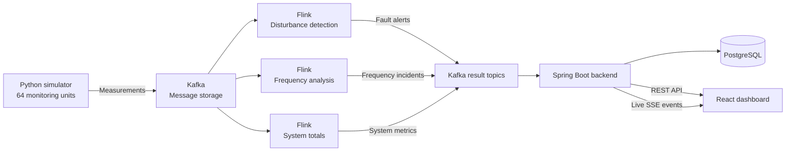
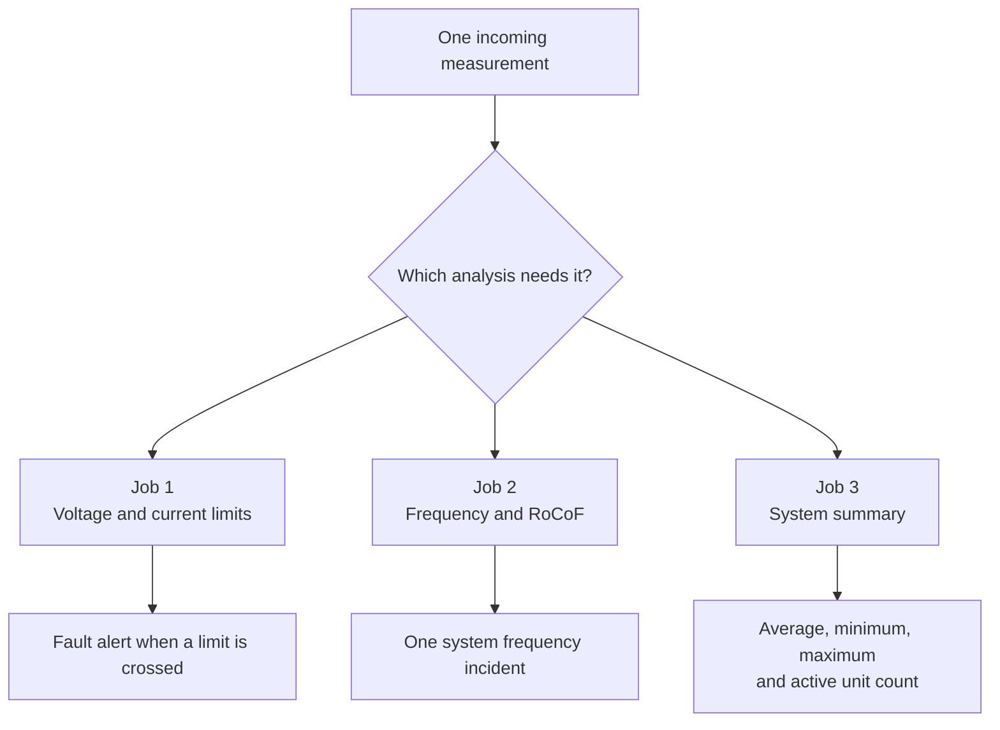
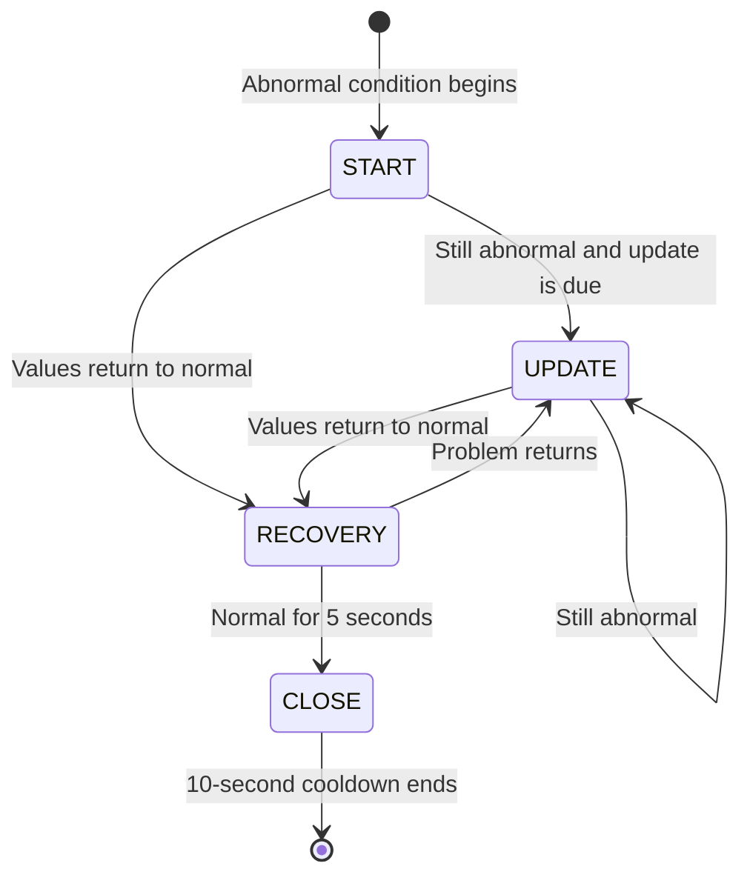
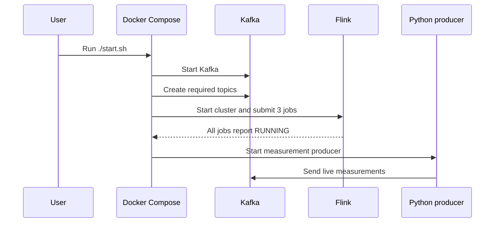

# Network Monitoring Project Guide

## 1. What this project is

This project is a small, complete example of a live electricity network monitoring system.

It creates fake measurements for a simulated **20 kV distribution network**, sends them through a data pipeline, finds unusual values, saves alerts, and shows everything on a web dashboard.

The simplest honest description is:

> Real-time monitoring and threshold-based disturbance alerting for a simulated 20 kV distribution network.

The system is useful for learning and demonstrations. It is **not** a protection relay and must not control real electrical equipment.

## 2. The main idea

Think of the system like a school with many classrooms:

- Each monitoring unit is a student who reports what is happening in one room.
- Kafka is the school mailbox where all reports are placed.
- Flink is the teacher who reads reports and looks for problems.
- PostgreSQL is the school record book.
- Spring Boot is the office worker who finds records when someone asks for them.
- React is the notice board where people can see the latest information.

The real data flow looks like this:



### Why these tools were chosen

Each tool has one clear job:

| Tool | Why it fits this project |
|---|---|
| Python | Makes it quick to create changing demo measurements |
| Kafka | Keeps producers and consumers separate, so they do not all need to run at the same speed |
| Flink | Is made for calculations over live data and short time windows |
| Spring Boot | Connects Kafka, the database, and the web API in one backend |
| PostgreSQL | Stores structured records that can be filtered by time, type, and location |
| React | Updates dashboard parts without reloading the whole page |
| Docker Compose | Starts the local services in a repeatable way |

This separation also makes the system easier to understand. For example, changing a chart should not require changing the measurement simulator.

## 3. Electricity basics

You do not need electrical engineering knowledge to understand the project. These are the main ideas.

### 3.1 Distribution network

Electricity travels through different network levels:

1. Power plants generate electricity.
2. High-voltage transmission lines move it across long distances.
3. Distribution networks bring it closer to towns, businesses, and homes.
4. Transformers reduce the voltage before electricity reaches customers.

This project uses **20 kV**, or 20,000 volts. That is a medium-voltage distribution level. It is suitable for feeders and substations, not for a sensor inside a house.

### 3.2 Disturbance and fault are not the same thing

A **disturbance** is any unusual change in the network. A short voltage drop, a switching action, or a large motor starting can all be disturbances.

An electrical **fault** is a more specific problem. Electricity has found a path that it should not use. Examples include:

- A damaged cable touching earth.
- Two conductors touching each other.
- A tree branch touching a line.
- Broken insulation inside equipment.

Think of a water pipe. Normal water follows the pipe. A crack creates a new path and lets water escape. An electrical fault is similar: current follows an unwanted path.

A fault can cause high current and low voltage at the same time. Protection relays may then disconnect the affected part very quickly to limit equipment damage, fire risk, and danger to people.

Common fault groups are:

| Fault group | Simple meaning |
|---|---|
| Line-to-earth | One conductor touches earth or grounded equipment |
| Line-to-line | Two conductors touch each other |
| Three-phase | All three phases become connected; uncommon but often severe |
| Open conductor | A conductor breaks, causing missing or unbalanced supply |

The important rule is:

> Not every disturbance is a fault, and one unusual measurement is not enough to prove the cause.

This project sees magnitudes only. It can say “a limit was crossed,” but it cannot confirm which fault happened. That is why the code name `FaultAlert` should be understood as a **disturbance alert** in the current MVP.

### 3.3 Voltage

Voltage is similar to water pressure in a pipe. It pushes electric charge through the network.

The simulated normal voltage is **20,000 V**.

- Too little voltage is called a **voltage sag**.
- Too much voltage is called a **voltage swell**.

This project uses these limits:

| Condition | Rule | Simple meaning |
|---|---:|---|
| Voltage sag | Below 18,000 V | Below 90% of normal |
| Normal range | 18,000–22,000 V | Inside the demo limits |
| Voltage swell | Above 22,000 V | Above 110% of normal |

Example: if a unit reports 17,200 V, the voltage is 800 V below the sag limit, so the system creates a sag alert.

#### Why a voltage sag can happen

- A short circuit pulls a large current from the network.
- A large motor starts and briefly needs much more current.
- A transformer is switched on.
- A nearby feeder has a problem, even if this feeder stays connected.

Possible effects include lights becoming dim, motors slowing down, control equipment resetting, and factory processes stopping. The effect depends on how low the voltage goes and how long it stays low.

#### Why a voltage swell can happen

- A large load suddenly disconnects.
- A switching action changes the network voltage.
- Voltage-control equipment uses a wrong setting or reacts too slowly.
- A wiring or grounding problem affects one or more phases.

Possible effects include stress on insulation, shorter equipment life, protection trips, and damage to sensitive electronics.

In a real network, one high or low sample is not always an event. Engineers also check duration, affected phases, measurement quality, and whether nearby devices saw the same change.

### 3.4 Current and overcurrent

Current is similar to the amount of water flowing through a pipe.

The simulated normal current is **400 A**. The overcurrent alert limit is **1,200 A**.

**Overcurrent** means that current is above an allowed limit. It can happen because of:

- **Overload:** too many loads use the line for too long.
- **Short circuit:** electricity finds a very low-resistance unwanted path.
- **Starting current:** a motor briefly draws high current while starting.
- **Inrush current:** a transformer briefly draws high current when switched on.

High current heats cables and equipment. More current creates much more heat, so a large overcurrent can damage insulation, age equipment, start a fire, or cause protection to disconnect the line.

The allowed current is different for each real cable, transformer, temperature, and operating condition. The project uses one fixed value only to keep the demo simple. “Current above 1,200 A” is therefore an alert, not proof of a short circuit.

### 3.5 Frequency

The network uses alternating current. Its wave repeats about **50 times each second**, so the normal frequency is **50 Hz**.

Frequency shows the balance between produced and used electrical power:

- If demand becomes greater than production, frequency tends to fall.
- If production becomes greater than demand, frequency tends to rise.

Think of people pedaling one large shared bicycle. They must keep a steady pace while the road pushes back. If the road suddenly becomes harder and nobody pedals more, the bicycle slows down. If the road becomes easier while everyone keeps pushing, it speeds up. Production, demand, and frequency have a similar balance.

#### Why frequency can become low

- A large generator stops.
- An incoming power line disconnects.
- Demand suddenly increases.
- Part of the network becomes separated with too little local production.

#### Why frequency can become high

- A large load disconnects.
- Production suddenly becomes greater than demand.
- A separated network area has too much local production.

Small changes are normal. A large or long change can affect motor speed, stress generators and turbines, trigger protection, or force automatic load shedding. **Load shedding** means turning off selected customers to stop a wider blackout.

North Macedonia is part of the Continental Europe synchronous area. Connected countries normally move at almost the same system frequency. For this reason, the project treats frequency as one system value, not as eight unrelated regional values.

### 3.6 RoCoF

RoCoF means **Rate of Change of Frequency**. It answers this question:

> How quickly is frequency moving up or down?

For example:

- 50.0 Hz to 49.9 Hz in one second is about -0.1 Hz/s.
- 50.0 Hz to 49.3 Hz in one second is about -0.7 Hz/s.

A large RoCoF can be a sign of a sudden generation or load imbalance. The project uses:

| Condition | Rule |
|---|---:|
| Frequency deviation | More than 0.2 Hz away from 50 Hz |
| High RoCoF | More than 0.33 Hz/s |
| Critical RoCoF | More than 0.67 Hz/s |

Frequency tells us where the system is now. RoCoF tells us how quickly it is moving. For example, 49.8 Hz may not look extreme, but a fast downward RoCoF warns that it could become serious soon.

A fast change may trigger generator protection, make a small separated area unstable, or lead to fast load shedding. RoCoF is still only evidence; bad time stamps and noisy measurements can also create a false high value. This is why measurements must share the same time and why the code calculates RoCoF between reporting frames.

These are demonstration settings. Real limits must come from the network operator, local grid rules, measurement method, and equipment settings.

## 4. What a PMU normally is

PMU means **Phasor Measurement Unit**.

A real PMU normally reports:

- Voltage magnitude and phase angle.
- Current magnitude and phase angle.
- Frequency and RoCoF.
- An accurate shared time stamp.
- Data quality and time quality information.
- Measurements many times per second.

A phase angle tells us where one electrical wave is compared with another wave. Imagine two people running around a circular track at the same speed. The angle tells us how far one runner is ahead of the other.

This project uses a simplified PMU-like model. It reports only:

- Voltage magnitude.
- Current magnitude.
- Frequency.
- Location information.
- One shared batch time stamp.

It does not contain phase angles, three-phase values, data-quality flags, or the extra calculated values that engineers use to study unbalanced problems. Calling the devices **simulated monitoring units** or **simplified distribution PMUs** is therefore more accurate.

## 5. The simulator

The Python program in [`pmu_producer.py`](../pmu_producer.py) creates the input data.

### 5.1 Simulated network size

The project contains:

- 8 regions.
- 2 substations in each region.
- 4 monitoring units in each substation.
- 64 monitoring units in total.

Every unit uses the same demo base values:

- 20,000 V.
- 400 A.
- 50 Hz.

### 5.2 Reporting batches

All 64 measurements in one batch receive the same time stamp. This matters because they describe the network at the same moment.

It is like taking one group photo. Everyone in the photo belongs to the same moment. Giving each person a different time would make the photo hard to understand.

A new batch is produced roughly every 0.5 to 1.2 seconds. That is enough for this dashboard, but much slower than a real PMU stream.

### 5.3 Normal noise and unusual values

Normal values include small random changes. Real measurements are never perfectly still, so a flat line would look artificial.

Voltage and current anomalies are generated separately. A voltage anomaly no longer forces a current anomaly, and a current anomaly no longer forces a voltage anomaly.

The shared system frequency can also move as a ramp over several seconds. This creates a change that the RoCoF calculation can measure.

The simulator is random and does not use a power-flow model. It cannot prove that an alert algorithm found a real fault. A future simulator should publish a separate ground-truth record saying what event was created, where it happened, and when it ended.

## 6. Kafka: the message mailbox

Kafka stores messages in named topics. A topic is similar to a separate mailbox for one type of letter.

The project uses:

| Topic | Contains |
|---|---|
| `pmu-measurements` | Raw simulated measurements |
| `fault-alerts` | Voltage and current alerts |
| `frequency-alerts` | System frequency incidents |
| `system-metrics` | Network-wide summary values |

The `kafka-init` Compose service creates these topics before Flink starts. This prevents jobs from starting against missing topics.

## 7. Flink: the live data worker

Flink reads data as it arrives and runs three jobs.



### 7.1 Job 1: disturbance detection

[`SimpleFaultDetectionJob`](../NetworkMonitoring/src/main/java/org/example/jobs/SimpleFaultDetectionJob.java) sends each measurement to [`FaultDetectionFunction`](../NetworkMonitoring/src/main/java/org/example/windowsFunctions/FaultDetectionFunction.java).

The function checks three rules:

- Voltage below 18,000 V.
- Voltage above 22,000 V.
- Current above 1,200 A.

Each matching sample creates an alert with a new ID. This is simple and easy to demonstrate, but a long event can create several alerts. A future version should group those samples into one disturbance incident.

### 7.2 Severity score

The severity score goes from 0 to 1:

| Score | Level |
|---:|---|
| Below 0.30 | Low |
| 0.30 to below 0.50 | Medium |
| 0.50 to below 0.80 | High |
| 0.80 and above | Critical |

The score starts near zero when a value has just crossed its alert limit. It grows as the value moves farther away.

Examples:

- A voltage of 17,900 V is just below the sag limit, so it is Low.
- A voltage of 17,200 V has a score of 0.40, so it is Medium.
- A current of 1,600 A has a score of 0.50, so it is High.

This score is a dashboard priority, not a protection command.

### 7.3 Job 2: frequency analysis

[`FrequencyStabilityJob`](../NetworkMonitoring/src/main/java/org/example/jobs/FrequencyStabilityJob.java) uses a three-second window that moves every second.

A moving window is like watching the latest three seconds of a race, then moving the camera forward by one second and watching again. Windows overlap, which gives regular updates but can create duplicate alerts if they are not grouped.

The job solves this by creating one incident with one stable ID.

#### Step 1: align reporting frames

Measurements with the same time stamp are grouped into one reporting frame.

#### Step 2: find the system frequency

The system uses the median frequency for each frame. The median is the middle value after sorting.

Example:

```text
49.99, 50.00, 50.01, 50.02, 55.00
```

The median is 50.01 Hz. The bad 55 Hz value does not pull the answer far away, while a normal average would be affected more.

#### Step 3: calculate RoCoF

RoCoF is calculated from the change between reporting frames over time. Measurements from different units at the same moment are not treated as separate time steps.

#### Step 4: manage one incident



The states mean:

- `START`: a new problem appeared.
- `UPDATE`: the same problem continues or becomes worse.
- `RECOVERY`: values returned to normal, but the system waits before closing.
- `CLOSE`: the values stayed normal long enough.

Normal updates are limited to one every 10 seconds. A worse severity creates an immediate update. After closing, a 10-second cooldown prevents a quick flood of new incidents.

#### Regional evidence

Frequency is mainly a shared system value, but local measurements can disagree because of bad data, timing problems, or a system split.

The code finds a middle frequency for each region and compares it with the middle system value. A region is listed only when its difference is larger than both:

- A minimum 0.05 Hz difference.
- A limit based on the normal measurement noise.

This is a useful demo rule, not proof that a region separated from the grid.

### 7.4 Job 3: system metrics

[`SystemAggregationJob`](../NetworkMonitoring/src/main/java/org/example/jobs/SystemAggregationJob.java) uses a 1.5-second window that moves every 0.5 seconds.

It calculates:

- Number of active monitoring units.
- Average, minimum, and maximum frequency.
- Average, minimum, and maximum voltage.
- Average, minimum, and maximum current.

These values give a quick overview. An average can hide a local problem, so a real operator view would also need feeder and phase charts.

## 8. Event time and shared time stamps

Flink uses the time inside each measurement, called **event time**. It does not rely only on the time when the message reaches Flink.

This matters because network messages can arrive late or in a different order. It is like sorting letters by the date written inside each letter instead of the time the postal worker opened the bag.

The current jobs allow measurements to arrive up to 100 milliseconds out of order.

## 9. Backend and database

The Spring Boot backend performs three jobs:

1. Reads result messages from Kafka.
2. Saves them in PostgreSQL.
3. Sends them to the dashboard.

### 9.1 REST API

REST endpoints let the dashboard request stored data.

Main endpoints:

```text
GET /api/fault-alert
GET /api/frequency-alert
GET /api/system-metrics
GET /api/system-metrics/latest
GET /api/events/stream
```

Alert endpoints support time, type, severity, and location filters. Results are limited so one request does not load the whole database.

### 9.2 SSE live updates

SSE means **Server-Sent Events**. It keeps one web connection open so the backend can send new information to the browser.

Normal REST is like calling a shop and asking, “Do you have an update?” SSE is like leaving the call open so the shop can tell you as soon as something changes.

The backend sends:

- `fault-alert`
- `frequency-alert`
- `system-metric`

A heartbeat is sent every 15 seconds to keep the connection alive.

### 9.3 Frequency incident storage

All updates for one frequency incident use the same database ID. Saving a new state updates the same row instead of creating hundreds of rows.

This keeps the incident list clean, but it also means the database stores only the latest state. While the dashboard is connected, it can receive the `START` to `CLOSE` changes through SSE. Those changes are not saved as a separate history.

## 10. Dashboard

The React dashboard shows:

- Latest network averages.
- Frequency and voltage charts.
- Active monitoring unit count.
- Fault and frequency alert tables.
- Filters and alert details.
- Live connection state.
- Critical alert notifications.

When a critical frequency incident recovers or closes, its critical notification is removed because the active danger has ended.

## 11. Startup order

The order matters. Starting consumers before Kafka topics exist can make jobs fail.



The producer starts only after the job submission container confirms that all three Flink jobs are running.

## 12. What the project can claim

The project can honestly claim:

- Live processing of simulated 20 kV measurements.
- Threshold-based voltage and current disturbance alerts.
- Basic system frequency and RoCoF monitoring.
- Deduplicated frequency incident handling.
- Stored history, REST queries, and live dashboard updates.
- A complete Python, Kafka, Flink, Spring Boot, PostgreSQL, and React pipeline.

The project should not claim:

- Standards-compliant PMU measurements.
- Confirmed electrical fault detection.
- Fault type classification or fault location.
- Protection relay behavior or automatic trip decisions.
- Production readiness for a real grid.

## 13. Important current limits

### Domain limits

- Values come from random rules, not an electrical network model.
- There are no three-phase measurements or phase angles.
- Fault alerts do not check event duration.
- There is no feeder topology or fault location.
- Every unit uses the same base voltage and current.
- There is no labeled ground truth for measuring detection quality.

### Technical limits

- Flink checkpointing is disabled, so job state is not safely restored after a restart.
- Sources begin from the latest Kafka data after a fresh start.
- Bad input can stop a Flink job; there is no dead-letter topic.
- Database changes use automatic schema updates instead of migrations.
- The system has no login, roles, TLS, or secrets manager.
- Frequency incident state changes are not stored as a full history.

## 14. Smallest useful next steps

The MVP order should be:

1. Add duration, recovery, deduplication, and stable IDs to voltage and current incidents.
2. Enable Flink checkpoints and stable Kafka consumer groups.
3. Send invalid messages to a dead-letter topic instead of stopping a job.
4. Add seeded scenarios and a separate ground-truth Kafka topic.
5. Add three-phase voltage/current phasors and data-quality flags.
6. Use per-unit values and separate limits for each real monitoring point.
7. Store incident transition history and add operator acknowledgement.

## 15. Short glossary

| Word | Simple meaning |
|---|---|
| Distribution network | The part of the grid that brings electricity closer to users |
| Feeder | A line that carries electricity from a substation to an area |
| Substation | A place where electricity is switched, measured, or transformed |
| PMU | A device that measures synchronized electrical waves |
| Phasor | The size and angle of an electrical wave |
| Voltage | Electrical “pressure” |
| Current | Flow of electric charge |
| Frequency | Number of AC wave cycles each second |
| RoCoF | How fast frequency is changing |
| Kafka topic | A named stream of messages |
| Flink window | A small time period analyzed as one group |
| Incident | One problem that can have several updates |
| REST API | A way for the browser to request stored data |
| SSE | A live one-way update connection from server to browser |

## 16. Domain references

- [North Macedonia Energy Regulatory Commission annual report](https://www.erc.org.mk/odluki/2023.04.26_RKE%20GI%202022-FINAL%20ENG%20VERSION.pdf) — describes the local 10/20 kV distribution network.
- [U.S. Department of Energy synchrophasor primer](https://www.energy.gov/oe/articles/synchrophasor-technologies-and-their-deployment-recovery-act-smart-grid-programs-august) — explains PMUs, phasors, time alignment, and reporting speed.
- [IEEE/IEC 60255-118-1](https://standards.ieee.org/ieee/60255-118-1/5724/) — defines synchronized phasor, frequency, RoCoF, and time-tag requirements.
- [IEC 61000-4-30](https://webstore.iec.ch/en/publication/68642) — covers measurement of voltage dips, swells, frequency, and other power-quality values.
- [IEEE 1159](https://standards.ieee.org/ieee/1159/6124/) — gives recommended practices for monitoring electric power quality.
- [ENTSO-E Continental Europe explanation](https://www.entsoe.eu/news/2021/01/26/system-separation-in-the-continental-europe-synchronous-area-on-8-january-2021-2nd-update/) — explains why connected countries normally share one frequency.
